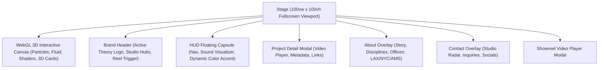

# Page Topology: Active Theory

## Layers
1. **Layer 0 (Canvas):** Three.js WebGL canvas rendering the interactive fluid particle field, background mesh, and 3D work cards.
2. **Layer 10 (HUD & Chrome):**
   - Brand Header at top: `ACTIVE THEORY` monogram/wordmark, sound status, quick tag.
   - Floating Navigation capsule at bottom center: `WORK`, `ABOUT`, `CONTACT`, Audio toggle.
   - Status indicators: current project counter (`01 / 65`), active project tag.
3. **Layer 50 (Modals & Overlays):**
   - Project Detail viewer with video playback.
   - Reel video player.
   - About view.
   - Contact view.
